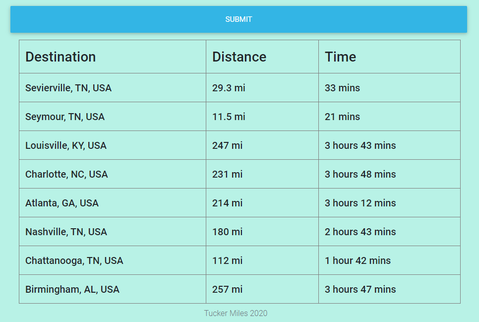

## Distance-Matrix

This project allows users to input a list of places they go to (such as doctors offices, family/friend's houses, grocery stores, etc) and generate a nice way to view the distance and average time to get to all of them. The user is able to set a departure/arrival time, change their travel type(driving, walking, cycling), set units(imperial or metric), and choose to avoid certain things (tolls, highways, ferries, indoor) on their trip! Once the form is submitted, a table is displayed on the webpage, and a printable pdf is generated with the same information.

My motivation for this was to create a tool for people who may not be tech-savvy or comfortable enough to use their computer to get this sort of information. For example, someone who is elderly could submit this form, print the pdf, and keep it on hand for quick reference.

## Usage

The tool is simple to use. Just input your source and as many destinations as you'd like to, up to 8. These can be as broad or as specific as you'd like them to be (a town vs a specific address). Then select any additional paramaters that you may want, and click the submit button. After this, your distance table will  be generated.

For example, let's use default settings, Knoxville as a source, and random places as our destinations as below.

Now, click the submit button, and your table shows up on the page:

You can also see that a PDF download has now popped up in your tray: 

This PDF contains the same information in a portable, printable format!

## Usage II

Now, let's try this again but with a few additional options. 

We have a few options here, we can specifiy either a departure time or an arrival time, travel type, units, or pick from a few things to avoid. You can see below how simple it is to select these options.

Let's use the same source and destinations, but for this example let's say we want cycling as our travel mode, we want to avoid higways, and we want metric units. Here's the form for that:

And when we submit this, you the results are presented in the exact same format as before, but were generated with the selected options as seen here:

## The Tech

........

<!-- Notes for when I write this -->
<!-- Add general photo at top -->
<!-- Show how specific the destination can be, as well as broad -->
<!-- Talk about the tech I used (jsPDF, jsPDF-autotable, and Google's Distance Matrix) -->